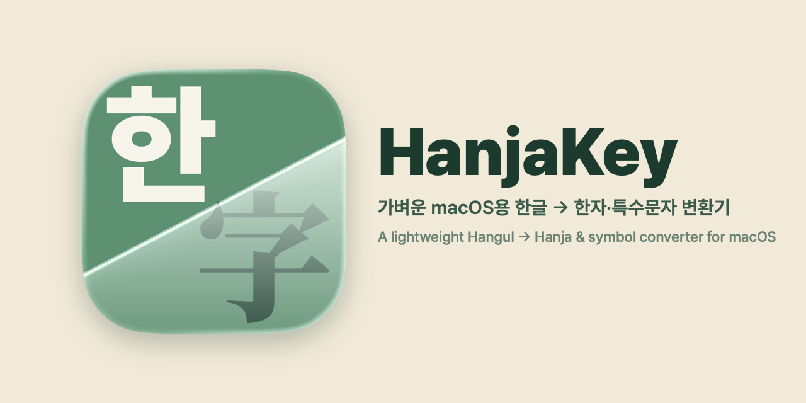
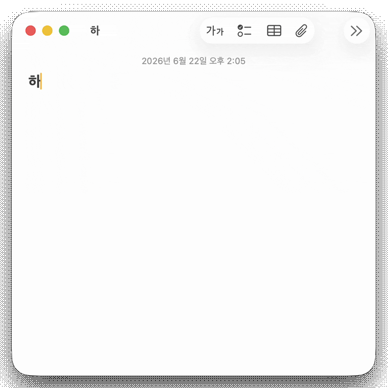
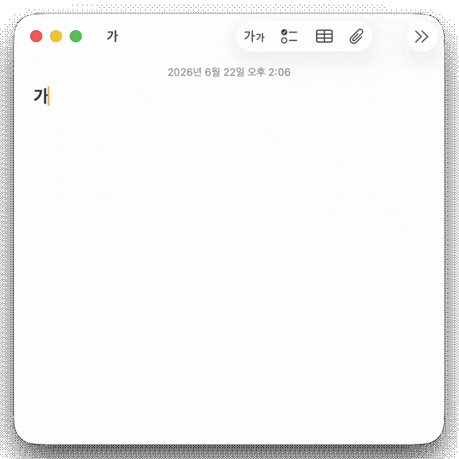
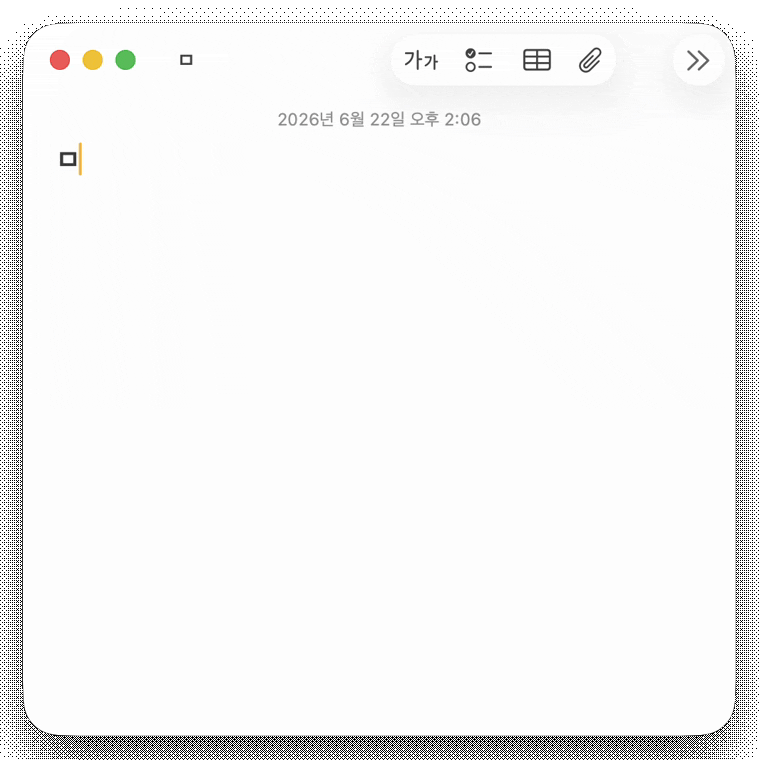

<p align="center">
  
</p>

# HanjaKey

A macOS menu-bar app that brings the Windows **Hanja key** to the Mac. Without changing your input
method, one global hotkey turns the Hangul before your caret into Hanja or special symbols, in place.

> 한국어: [README.md](README.md)

<p align="center">
  <br>
  <sub>Word recognition · 한자 → 漢字 (ranked, with meanings)</sub>
</p>

<table align="center">
  <tr>
    <td align="center"><br><sub>Single Hanja · 가 → 歌</sub></td>
    <td align="center"><br><sub>Special symbols · ㅁ → ♥</sub></td>
  </tr>
</table>

## Overview

macOS's Korean input method can convert Hangul to Hanja (`Option+Return`), but it has **no way to
enter special symbols from a jamo**, and it only works while Korean input is active. HanjaKey is
callable anywhere via a global hotkey, regardless of the input source, and gathers Hanja and
KS X 1001 symbols into one picker that inserts in place.

## Features

- **Syllable → Hanja** : 한 → 韓 · 漢 · 寒 …
- **Jamo → special symbol** : ㅁ → ※ ◎ □ …, ㄷ → ± × ÷ …
- **Word → Hanja word** : 대한민국 → 大韓民國, 한자 → 漢字

Each Hanja and Hanja-word carries a short reading and meaning. The special symbols use the same
KS X 1001 layout as the Windows IME, and Hanja and Hanja-words are ordered by frequency (most common first).

## Compatibility

- **Supported** : native apps (TextEdit, …), Electron apps (Claude, Discord, …), browsers — **most macOS apps**
- **Not supported** : terminals; they don't expose editable accessibility (AX) text.

## Usage

1. Type Hangul, keep the caret right after it, and press `⌥ + ⌘ + H`
   - For words it auto-grabs the 어절 (Hangul run) before the caret, or uses your selection if you made one.
2. Pick a candidate
   - `1–9` select · `↑↓` `←→` move·page · `Tab` expand · `↵` insert · `esc` cancel
3. For words not in the dictionary, use **‘음절별로 만들기’** (build per syllable) to assemble one character at a time

Settings live behind the menu-bar **字** icon or the popup's **⋯ → Settings** — expanded view
(wide/compact grid), fullwidth/halfwidth symbols, custom user sets, and menu-bar icon visibility.

## Install

**Homebrew (recommended)** — the easiest way to install and stay up to date:

```sh
brew install --cask SJY051/tap/hanjakey
```

Update later with `brew upgrade --cask hanjakey`. (If you've enabled `HOMEBREW_REQUIRE_TAP_TRUST`, run `brew trust SJY051/tap` first.)

**Download** — grab `HanjaKey-vx.y.z.dmg` from
[Releases](https://github.com/SJY051/HanjaKey/releases/latest), open it, and **drag HanjaKey to your
Applications folder.** (Runs on macOS 14+.)

**First launch** — this build is **Apple-notarized**, so it launches with no Gatekeeper warning. On first run, just grant **Accessibility** (System Settings → Privacy & Security → Accessibility) — the app's core features need it. One time only.

> ℹ️ Upgrading from a self-signed build (v0.1.2/v0.1.3)? The signing identity changed, so you may need to re-grant Accessibility once.

**Build from source** — `scripts/bundle.sh` → `.build/HanjaKey.app`; see
[CONTRIBUTING.md](CONTRIBUTING.md) for setup, and [KeyboardShortcuts](https://github.com/sindresorhus/KeyboardShortcuts) for hotkeys.

## Data / credits

This repository's source is MIT-licensed, but **bundled data keeps each source's own license** (not relicensed to MIT).
Full list and details in [`THIRD_PARTY_DATA.md`](THIRD_PARTY_DATA.md).

- **Hanja & Hanja-word inventory** — [libhangul](https://github.com/libhangul/libhangul) `hanja.txt` · BSD 3-Clause · © 2005,2006 Choe Hwanjin
- **Special symbols** — KS X 1001 per-jamo layout (first-party)
- **Hanja-word frequency (homophone ranking)** — NIKL "Modern Korean Usage Frequency Survey" (2002) · KOGL Type 1 (attribution)
- **Hanja-word glosses** — NIKL Standard Korean Dictionary · **CC BY-SA 2.0 KR**
- **Single-Hanja gloss (fill)** — Korean Wiktionary · **CC BY-SA** / NeoMindStd [HanjaDB](https://github.com/NeoMindStd/HanjaDB) · MIT
- **Single-Hanja ordering & gloss (generated)** — first-party LLM-generated HanjaKey data · MIT

> The dictionary and Wiktionary data are distributed under **CC BY-SA (ShareAlike)**, and the NIKL
> frequency survey under **KOGL Type 1 (attribution)**. Keep the attribution and ShareAlike terms when redistributing.

## Contributing

Bug reports and PRs are welcome — see [CONTRIBUTING.md](CONTRIBUTING.md) for setup, project layout, and conventions.

## License

- Code: [MIT](LICENSE)
- Bundled data: each source keeps its own license — see [`THIRD_PARTY_DATA.md`](THIRD_PARTY_DATA.md). The
  CC BY-SA and KOGL data are not MIT; the original copyright/attribution notices stay in the data files.
